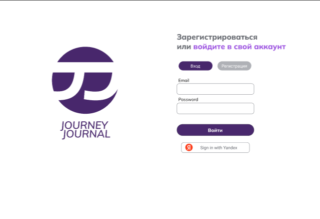
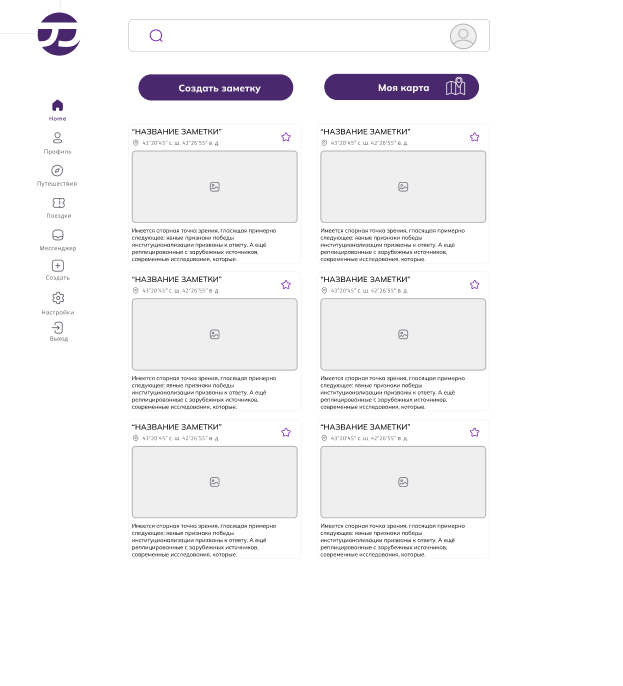
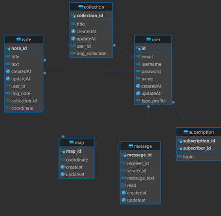

# Journey_Journal_V3

   
   
  
   
 

## Работы по проекту, которые были выполнены:
1. Определение требований к результату
2. Изучение необходимых теоретических материалов
3. Подготовка теоретических материалов
4. Разработка дизайна в Figma - [Figma](https://clck.ru/3AdWaV)
5. Разработка логотипа в Adobe Illustrator 

    

6. Используемое ПО:
- Insomnia
- DBeaver
- Visual Studio Code
7. Используемые языки верстки и программирования:
- HTML  
- SCSS
- TypeScript
- JavaScript
- PostgreSQL 15
8. Используемые фреймворки:
- Angular 17
- Node.js 

9. Используемые библиотеки:
- RxJS
- TypeORM
- Ngx-Toastr
- jwt
- Passport-jwt

10. Работы выполненные в рамках Frontend (Angular 17): 
- Верстка страницы login
- Верстка страницы signup
- Верстка страницы home
- Верстка страницы journey
- Верстка страницы collection
- Верстка страницы settings
- Верстка страницы createNotes
- Верстка страницы messenger
- Верстка Sidebar 
- Верстка Header
- Связывание логики верификации и регистрации с интерфейсом
- Переходы между страницами аутентификации/регистрации 

<!-- Верстка модального окна:
    - Модального окна "Создание заметки",
    - Модального окна "Моя карта",
    - Модального окна "Создание подборки" -->

11. Работы выполненные в рамках Backend (Node.js): 

- Разработка базы данных СУБД PostgreSQL 

     

  

- Подключение базы данных
- Регистрация пользователей 
- Авторизация пользователей по JWT-токену
- Валидация данных 

- Collection - Создание, поиск, удаление, редактирование.
- Notes- Создание, поиск, удаление, редактирование.

12. Связывание логики Frontend и Backend 

Автор этого проекта/репозитория - [Zotov Oleg (Helgeee)](https://github.com/Helgeee).
